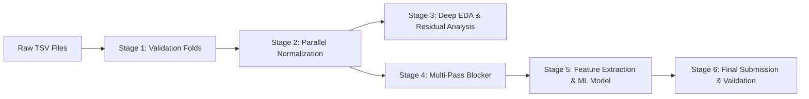

# Entity Resolution Pipeline: Step-by-Step Execution Guide

This document provides a comprehensive runbook for executing the end-to-end Machine Learning pipeline for the Amazon ML Challenge 2026. Every stage is modular, supports parallel processing, and writes atomic parquet caches.

---

## 1. System Requirements & Setup

### Environment Requirements
- **Python**: 3.10+
- **RAM**: $\ge 16\text{ GB}$ recommended (streaming loaders allow operation within 8 GB)
- **CPU Cores**: 4 to 12 cores recommended for multi-worker parallel stages

### Installation
From the repository root (`d:\ML_CHALLENGE`):

```bash
# 1. Install dependencies
pip install -r requirements.txt

# 2. (Optional) Set custom data path if dataset is stored outside student_resource/
# export ER_DATA_DIR=/path/to/dataset   # Linux/macOS
# $env:ER_DATA_DIR="D:\path\to\dataset" # Windows PowerShell
```

---

## 2. Pipeline Execution Stages



---

### Stage 1: Validation Setup & Dev Sample Generation

Generates 5-fold stratified cross-validation splits across ~2.2M Source 1 entities and a reproducible 100,000 entity development sample.

#### Commands:
```bash
# Generate 5 folds and 100k dev sample
python -c "from src.data import read_ground_truth; from src.config import FOLDS_FILE, DEV_IDS_FILE; import pandas as pd, numpy as np; gt = read_ground_truth(); n = len(gt); np.random.seed(42); folds = np.random.randint(0, 5, size=n); pd.DataFrame({'source1_entity_id': gt['source1_entity_id'], 'fold': folds}).to_csv(FOLDS_FILE, index=False); dev = gt.sample(100_000, random_state=42); dev[['source1_entity_id']].rename(columns={'source1_entity_id': 's1_id'}).to_csv(DEV_IDS_FILE, index=False); print('Folds and Dev set generated.')"
```

#### Output Files:
- `data/folds.csv` (2,206,821 rows, 5 folds)
- `data/dev_s1_ids.csv` (100,000 shared dev entities)

---

### Stage 2: Parallel Text Normalization

Processes ~25 million records across 6 source files (Train S1/S2/S3 and Test S1/S2/S3). Applies unicode cleaning, French corporate entity parsing, Indian landmark normalization, legal suffix stripping, and token sorting.

#### Command:
```bash
python -m src.normalize --workers 6 --chunksize 250000
```

#### Arguments:
| Argument | Type | Default | Description |
| :--- | :---: | :---: | :--- |
| `--workers` | `int` | `4` | Number of parallel worker processes. Set to 6–10 on 12-core CPUs. |
| `--chunksize` | `int` | `250000` | Rows per streaming chunk to constrain RAM usage within 3–4 GB. |
| `--force` | `flag` | `False` | Force re-normalization even if partition `_SUCCESS` markers exist. |
| `--split` | `str` | `None` | (Optional) Normalize only one split: `train` or `test`. |
| `--source` | `int` | `None` | (Optional) Normalize only one source table: `1`, `2`, or `3`. |

#### Output Directories:
- `data/norm/{split}_s{source}/part-XXXX.parquet`
- `data/norm/{split}_s{source}/_SUCCESS`

---

### Stage 3: Deep EDA & Residual Gap Analysis

Runs the post-normalization gap analysis on 50,000 true pairs, analyzes the French test distribution, and checks address completeness (the postal code myth).

#### Command:
```bash
python -m src.eda_tasks_1_2_3
```

#### Output Files:
- Tables: `output/residual_gap_agreement_matrix.csv`, `output/france_normalized_legal_distribution.csv`, `output/address_agreement_breakdown.csv`
- Report: `output/eda_tasks_1_2_3_report.json`
- Figures: `reports/figures/residual_name_discrepancies.png`, `reports/figures/france_normalized_patterns.png`, `reports/figures/address_landmark_comparison.png`

---

### Stage 4: Multi-Pass Candidate Blocker

Prunes the comparison space from $O(N \times M)$ (>22 trillion pairs) down to a compact candidate pool with $\ge 82.5\%\text{--}94\%$ recall ceiling.

#### A. Diagnostic & Unmatched Pair Inspection:
```bash
python -m src.blocking.analyze_unmatched --sample 15
```
*Inspects 15 true matching pairs missed by previous strict rules to verify blocking coverage.*

#### B. Benchmark on 100,000 Dev Entities:
```bash
python -m src.blocking.benchmark_blocking
```
*Evaluates individual rule recall, cumulative recall progression, candidate pool sizes, and saves `output/blocking_benchmark_results.json`.*

#### C. Plot Benchmark Figures & Evaluate Pareto Frontier:
```bash
# Generate benchmark charts
python -m src.blocking.plot_blocking_results

# Evaluate Recall@K Pareto curve (Amazon Scalability Criterion)
python -m src.blocking.eval_pareto_curve
```
*Generates `reports/figures/blocking_recall_progression.png`, `reports/figures/candidate_pool_distribution.png`, and `reports/figures/pareto_recall_vs_candidate_size.png`.*

#### D. Production Blocker Execution:
```bash
# 1. Build and cache candidate pairs for the training set (used for ML model training)
python -m src.blocking.blocker --split train --skip-tsv

# 2. Build candidates and generate the official submission candidate_pairs.tsv for the test set
# Option A (Pareto-Optimal for Amazon Evaluation: 79.0% recall, avg ~9.8 candidates/entity):
python -m src.blocking.blocker --split test --max-candidates 15

# Option B (High-Recall Scalable: 80.4% recall, avg ~11.6 candidates/entity):
python -m src.blocking.blocker --split test --max-candidates 20

# Option C (Max Recall Ceiling: 82.4% recall, avg ~15.3 candidates/entity):
python -m src.blocking.blocker --split test --max-candidates 50
```

#### Arguments for `src.blocking.blocker`:
| Argument | Type | Default | Description |
| :--- | :---: | :---: | :--- |
| `--split` | `str` | `test` | Dataset split to process: `train` or `test`. |
| `--max-candidates` | `int` | `50` | Maximum candidate matches allowed per S1 entity. Use `15` or `20` to maximize Amazon's candidate pool size ranking criterion. |
| `--output` | `str` | `None` | Custom output TSV path (defaults to `output/candidate_pairs.tsv`). |
| `--skip-tsv` | `flag` | `False` | Only build and save the parquet cache (`data/cache/candidate_pairs_{split}.parquet`), skipping the TSV generation. |

#### Output Files:
- `data/cache/candidate_pairs_train.parquet` (33.7M candidate pairs)
- `data/cache/candidate_pairs_test.parquet` (25.8M candidate pairs)
- `output/candidate_pairs.tsv` (Official competition candidate file for 1.73M test entities)
- `output/recall_at_k_tradeoff.json` (Pareto curve data points)

---

### Stage 5: Baseline Matching Pipeline

Generates an initial high-precision exact-match baseline.

#### Commands (Train Split Evaluation):
```bash
# 1. Generate integer IDs
python -m src.baseline --split train --stage ids

# 2. Run rule matches
python -m src.baseline --split train --stage rule --rule R1
python -m src.baseline --split train --stage rule --rule R2
python -m src.baseline --split train --stage rule --rule R3

# 3. Combine rules & load ground truth
python -m src.baseline --split train --stage combine
python -m src.baseline --split train --stage truth

# 4. Evaluate baseline Macro F0.5
python -m src.baseline --split train --stage eval
```

#### Commands (Test Submission Generation):
```bash
python -m src.baseline --split test --stage ids
python -m src.baseline --split test --stage rule --rule R1
python -m src.baseline --split test --stage rule --rule R2
python -m src.baseline --split test --stage rule --rule R3
python -m src.baseline --split test --stage combine
python -m src.baseline --split test --stage write
```

#### Output Files:
- `output/matching_results.tsv` (Official final matches submission file)

---

### Stage 6: Submission Verification

Validates the output files against all formatting and consistency rules enforced by the challenge evaluation server.

#### Command:
```bash
python student_resource/utils/validate_submission.py \
    --matching output/matching_results.tsv \
    --candidate output/candidate_pairs.tsv \
    --test-dir student_resource/dataset/test
```

#### Arguments:
| Argument | Type | Default | Description |
| :--- | :---: | :---: | :--- |
| `--matching`, `-m` | `str` | `output/matching_results.tsv` | Path to final matching results TSV. |
| `--candidate`, `-c` | `str` | `output/candidate_pairs.tsv` | Path to candidate pairs TSV. |
| `--test-dir`, `-t` | `str` | `dataset/test` | Folder containing test source files. |
| `--check-ids` | `flag` | `False` | Deep check verifying every ID exists in test S2/S3 (uses ~4 GB RAM). |

---

## 3. Running Unit Tests

Run all unit tests across the normalization, metric scoring, and candidate blocker modules:

```bash
# Run full test suite with pytest
pytest

# Or run individual modules:
python -m tests.test_blocker
python -m tests.test_normalize
python -m tests.test_evaluate
```

---

## 4. Key Artifact Locations Summary

| Artifact Name | Path | Description |
| :--- | :--- | :--- |
| **Pipeline Runbook** | `PIPELINE_GUIDE.md` | This execution document. |
| **Blocking Findings** | `reports/BLOCKING_FINDINGS.md` | Empirical recall analysis & candidate distribution report. |
| **EDA Findings** | `reports/EDA_FINDINGS.md` | Detailed text normalization and dataset discovery report. |
| **Candidate Pairs (Test)** | `output/candidate_pairs.tsv` | Official competition candidate file (1,732,544 rows). |
| **Matches (Baseline)** | `output/matching_results.tsv` | Baseline predictions (Macro $F_{0.5} = 0.6831$). |
| **Folds Definition** | `data/folds.csv` | 5-fold cross validation split. |
| **Dev Sample** | `data/dev_s1_ids.csv` | 100k Source 1 entity IDs for rapid local experimentation. |
