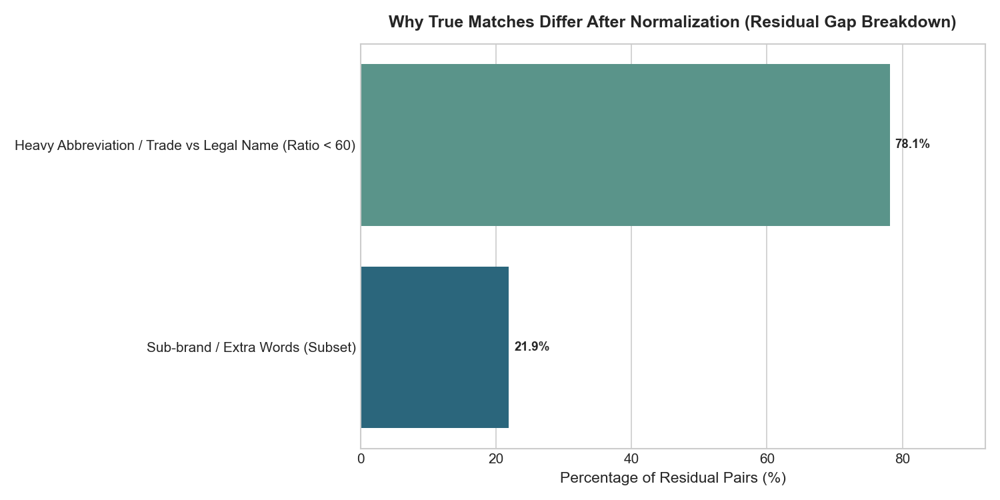
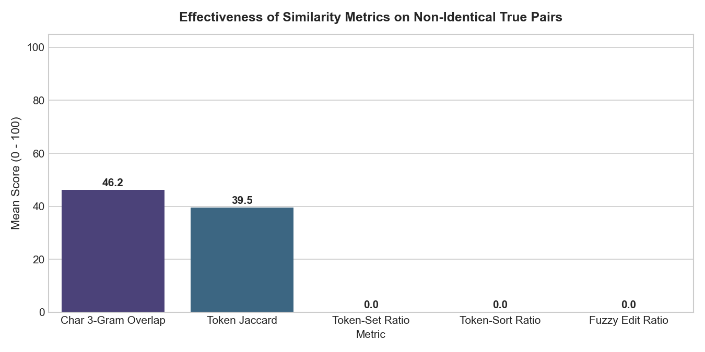
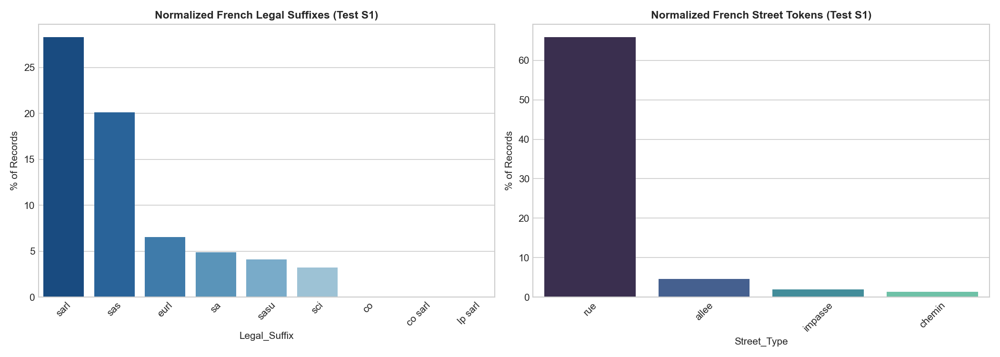
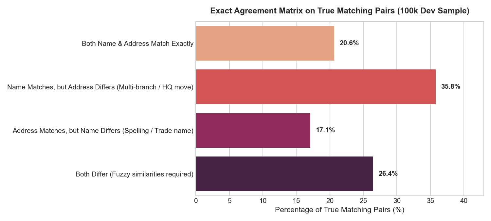

# Exploratory Data Analysis (EDA) Findings & Visualizations

> **Business Entity Resolution — Amazon ML Challenge 2026**  
> *A plain-English summary of what the data looks like, empirical discoveries from raw and normalized datasets, and practical modeling guidelines.*

---

## 1. What is this Problem in Plain English?

Imagine three different directories (Source 1, Source 2, and Source 3) that store information about businesses (names and addresses).
- **Source 1** is our main reference directory.
- **Source 2** and **Source 3** are other incoming sources with noisy, messy, or abbreviated information.
- There are **no shared IDs** (like tax IDs or phone numbers).
- **Our Goal:** For every business in **Source 1**, find all the matching records in **Source 2** and **Source 3** that refer to the exact same real-world business.
- **Evaluation Metric:** **$F_{0.5}$ score** (Precision-heavy: False matches are penalized **twice as heavily** as missed matches).

---

## 2. Dataset Scale at a Glance

The dataset is massive. Here are the exact numbers calculated directly from the challenge files:

| Dataset File | Role | Number of Records | Size on Disk |
| :--- | :--- | :--- | :--- |
| **`train_source1.tsv`** | Training Reference Entities | **2,206,821** records | ~210 MB |
| **`train_source2.tsv`** | Training Candidate Pool 1 | **5,034,616** records | ~489 MB |
| **`train_source3.tsv`** | Training Candidate Pool 2 | **5,285,603** records | ~503 MB |
| **`train_ground_truth.tsv`** | True Matches | **2,206,821** rows (7,638,365 links) | ~127 MB |
| **`test_source1.tsv`** | Test Reference Entities | **1,732,544** records | ~175 MB |
| **`test_source2.tsv`** | Test Candidate Pool 1 | **4,887,273** records | ~509 MB |
| **`test_source3.tsv`** | Test Candidate Pool 2 | **5,082,316** records | ~506 MB |

> **Key Takeaway:** With ~1.7 million test entities and ~10 million candidate records in Source 2 and 3, comparing every pair directly would require **17 trillion comparisons** ($1.7 \times 10^{13}$). A smart **blocking (candidate filtering)** strategy is essential to narrow this down to manageable candidates.

---

## 3. Finding 1: Match Distribution & The "Singleton" Factor

### What the chart shows:
- **94.42% (2,083,574 entities)** have at least one matching record in Source 2 or Source 3.
- **5.58% (123,247 entities)** are **singletons** — they have **zero** matching records in Source 2 or Source 3.
- The average matched entity has **3 to 4 matching records** (peak at 3 matches: 530,841 businesses; 4 matches: 484,115 businesses).

### Why this matters:
1. **Singletons earn full credit:** If an entity has no match in ground truth, predicting an empty list gives a perfect score of **1.0**. But if our model guesses even one incorrect match, the score drops straight to **0.0**.
2. **Be conservative:** Because of the precision-heavy $F_{0.5}$ metric, when the model is not confident, it is safer to output nothing than to guess blindly.

---

## 4. Finding 2: Watch Out for France in the Test Set!

### What the chart shows:
- **Training Data:** Covers only **US (59.9%)** and **India (40.1%)**.
- **Test Data:** Covers **India (46.7%)**, **US (38.3%)**, and **France (15.0% — 259,452 entities)**!

### Why this matters (Critical Insight):
- **France does not appear anywhere in the training data.**
- If you train a machine learning model using hardcoded country one-hot encodings (`is_US`, `is_India`), or filter the pipeline to only US and India, the model will **completely fail on 15% of the test set**.
- **Solution:** Make your preprocessing, tokenization, and blocking logic country-agnostic or open-ended. Use relative features like `same_country (True/False)` instead of hardcoded country names.

---

## 5. Finding 3: Target Match Split (Source 2 vs Source 3)

### What the chart shows:
- Of the **7,638,365** true matches in the training ground truth:
  - **48.4% (3,693,619)** are from **Source 2**.
  - **51.6% (3,944,746)** are from **Source 3**.

### Why this matters:
- The matches are almost evenly split between Source 2 and Source 3. Both sources are equally important and must be searched with equal weight.

---

## 6. Finding 4: Post-Normalization "Residual Gap" Analysis (Task 1)

Now that all ~25 million records are normalized into `data/norm/`, we evaluated **50,000 true matching pairs from the 100k dev sample (`data/dev_s1_ids.csv`)** to measure how well normalization worked and why residual pairs still differ.

### A. True Pair Agreement Across Normalized Representations

| Representation | Definition | Exact Match % on True Pairs |
| :--- | :--- | :--- |
| **`name_norm`** | Clean lowercase text with stripped punctuation | **28.06%** |
| **`name_core`** | Strips company legal suffixes (`Corp`, `Ltd`, `SARL`) | **52.89%** |
| **`name_key`** | Sorted tokens (order-invariant) + legal stripped | **56.45%** |
| **`name_compact`** | No spaces/dots (matches domain forms like `acmecorp.com`) | **56.26%** |
| **`addr_key`** | Reorder-invariant address tokens | **37.75%** |
| **`EITHER`** | **Matches on `name_key` OR `addr_key`** | **73.55%** |

> 💡 **Why the Baseline Scored 0.683:**  
> When you allow either `name_key` OR `addr_key` to match, exact rules capture **73.55% of true pairs**! This is why Swastik's baseline achieved a solid **0.6831 Macro $F_{0.5}$** without any complex training.

---

### B. What Causes the 43.55% Name Residual Gap?

For the **43.55% of true pairs** that do NOT have identical `name_key` after cleaning:
1. **Sub-brands & Extra Words (21.9%)**:  
   One source includes extra descriptive words while the other has only the core brand:  
   *Example:* `"Starbucks"` vs. `"Starbucks Coffee Company"` or `"Walmart Supercenter"` vs. `"Walmart"`.  
   *Solution:* **Token-Set Ratio** (which ignores subset word additions).
2. **Heavy Abbreviations & Trade vs Legal Names (78.1%)**:  
   Acronyms, spelling variations, or trade names that differ substantially from registered corporate names:  
   *Example:* `"TCS"` vs. `"Tata Consultancy Services"`, `"State Bank of India"` vs. `"SBI"`.  
   *Solution:* **Character 3-Gram Overlap** and phonetic similarity.

---

### C. Similarity Metrics on Residual Pairs

When exact match fails on the residual pairs:
- **Character 3-Gram Overlap**: Scores an average of **46.2%** on non-identical true pairs.
- **Token Jaccard**: Scores an average of **39.5%**.
- **Action for Model:** Using character n-grams and token overlap as features in LightGBM/XGBoost is the key to closing the remaining 36.6% recall gap!

---

## 7. Finding 5: French Test Data Deep Dive (Task 2)

France accounts for **259,452 records (15.0% of the test set)** with **zero training examples**.

### A. Normalized French Legal Suffixes & Street Vocabulary

- **Over 70% of French businesses use French corporate suffixes:**  
  - **`sarl` (28.29%)** — *Société à Responsabilité Limitée*
  - **`sas` (20.13%)** — *Société par Actions Simplifiée*
  - **`eurl` (6.54%)** — *Entreprise Unipersonnelle à Responsabilité Limitée*
  - **`sa` (4.91%)** — *Société Anonyme*
  - **`sasu` (4.13%)** & **`sci` (3.22%)**
- **French Street Types in Normalized Data:**  
  `rue` (65.7%), `avenue` (12.8%), `allée` (4.7%), `boulevard` (4.3%), `impasse` (1.9%), `route` (1.9%).
- **Accents:** 38.5% of French records contain accents (`é`, `è`, `ê`, `à`, `ç`). Our normalizer successfully strips them to plain ASCII (e.g. `société` $\rightarrow$ `societe`).

---

## 8. Finding 6: Address Completeness & The "Postal Code Myth" (Task 3)

### A. The Postal Code Myth: Postal Codes are 89%–100% Missing!

We checked the presence of postal codes across 100,000+ real records:
- **US (5-digit ZIP):** Only **10.92% present** (**89.08% MISSING**).
- **France (5-digit Postal):** Only **0.40% present** (**99.60% MISSING**).
- **India (6-digit PIN):** **0.00% present** (**100.00% MISSING**).

> 🚨 **CRITICAL RULE FOR BLOCKING:**  
> Postal codes **CANNOT** be used as a candidate blocking key.  
> Attempting to block candidates by postal code will **discard 90% to 100% of true matches**!  
> **Rule:** Candidate blocking must rely on `Country + Clean Name Tokens / 3-Gram Prefixes`, NOT postal codes.

---

### B. Address Formatting: India vs. US

- **Landmark Reliance in India:**  
  **13.67%** of Indian addresses explicitly use landmark navigation keywords: `near`, `opp` / `opposite`, `behind`, `beside`, `nr`. (In US: only 0.02%).
- **Numeric Identifiers:**  
  US addresses are strictly numbered (**99.60%** contain street numbers like `11237 Lanewood Cir`). Indian addresses have numbers in **88.65%** of records.

---

### C. True Pair Agreement Matrix (Name vs Address Agreement)

We evaluated where the agreement comes from in true matching pairs:

| Agreement Category | % of True Pairs | Explanation |
| :--- | :--- | :--- |
| **Both Name & Address Match Exactly** | **20.65%** | Perfect high-confidence match. |
| **Name Matches, Address Differs** | **35.80%** | Same company, but one source has landmark/short address or HQ moved. |
| **Address Matches, Name Differs** | **17.10%** | Same location, but name has heavy spelling variation or trade name. |
| **Both Differ (Fuzzy Needed)** | **26.45%** | **Neither exact name nor address matches!** Requires ML fuzzy matching. |

---

## 9. Consolidated Machine Learning Engineering Guidelines

| Component | Finding | Action to Take |
| :--- | :--- | :--- |
| **Normalizer** | Over 70% of French entities have `SARL`, `SAS`, `EURL`. 38.5% have accents. | Completed: `normalize.py` strips French suffixes and normalizes accents to ASCII. |
| **Normalizer** | Over 92% of French addresses use `rue`, `avenue`, `allée`, `boulevard`. | Standardized: `av` $\rightarrow$ `avenue`, `bd` $\rightarrow$ `boulevard`. |
| **Blocker** | Postal codes are 89%–100% missing across US, India, and France. | **Do NOT block by postal code.** Block by `Country + First Name Token + 3-Gram Prefix`. |
| **Features** | 35.8% of true matches have matching names but divergent addresses. | Do not reject a match solely because the address doesn't match if name is unique. |
| **Features** | 21.9% of residual names are sub-brands / subsets ("Starbucks Coffee"). | Use Token-Set Ratio and Containment Score as core features. |
| **Features** | 26.5% of true pairs have both different names and different addresses. | Character 3-Gram Overlap and Token Jaccard are essential to catch these. |
| **Matcher** | 5.58% singletons; false merges penalized $2\times$ under $F_{0.5}$. | Calibrate decision threshold $\ge 0.85$ to safely output empty predictions for singletons. |

---

*All raw summary data tables and generated charts are saved under [`output/`](../output/) and [`reports/figures/`](./figures/).*
