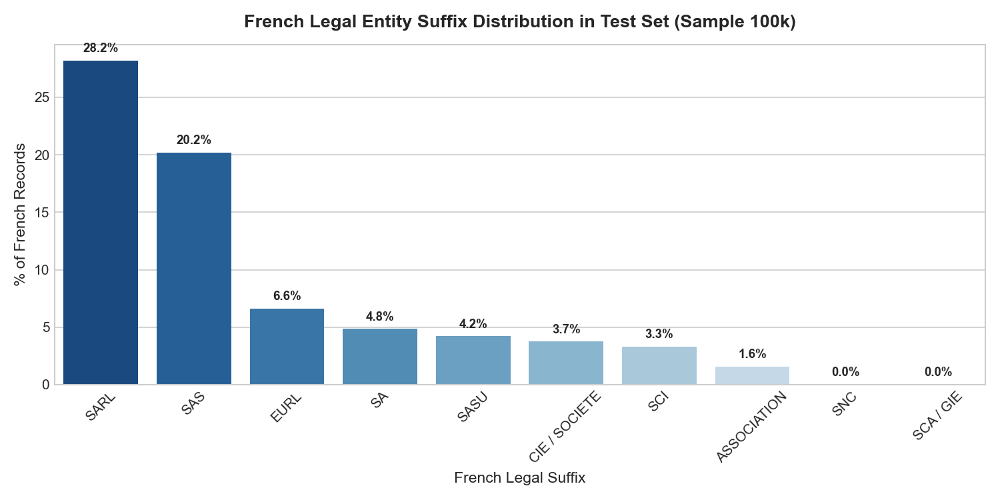
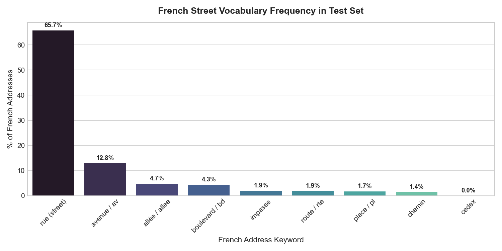
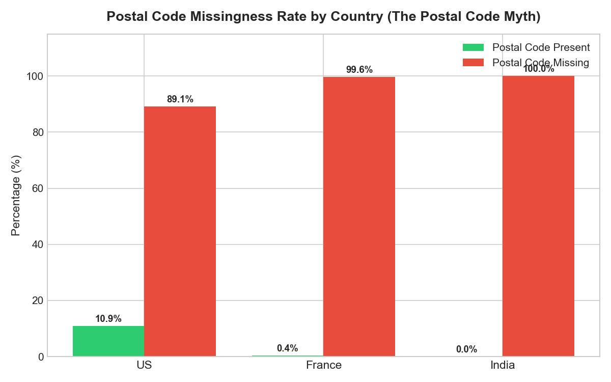
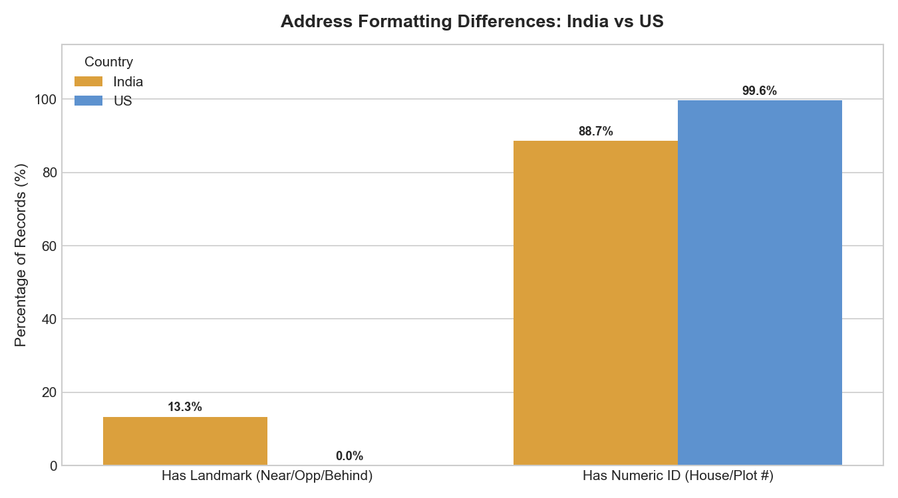

# Exploratory Data Analysis (EDA) Findings & Visualizations

> **Business Entity Resolution — Amazon ML Challenge 2026**  
> *A plain-English summary of what the data looks like, empirical discoveries from raw datasets, and practical modeling guidelines.*

---

## 1. What is this Problem in Plain English?

Imagine three different directories (Source 1, Source 2, and Source 3) that store information about businesses (names and addresses).
- **Source 1** is our main reference directory.
- **Source 2** and **Source 3** are other incoming sources with noisy, messy, or abbreviated information.
- There are **no shared IDs** (like tax IDs or phone numbers).
- **Our Goal:** For every business in **Source 1**, find all the matching records in **Source 2** and **Source 3** that refer to the exact same real-world business.
- **Evaluation Metric:** **$F_{0.5}$ score** (Precision-heavy: False matches are penalized **twice as heavily** as missed matches).

---

## 2. Dataset Scale at a Glance

The dataset is massive. Here are the exact numbers calculated directly from the challenge files:

| Dataset File | Role | Number of Records | Size on Disk |
| :--- | :--- | :--- | :--- |
| **`train_source1.tsv`** | Training Reference Entities | **2,206,821** records | ~210 MB |
| **`train_source2.tsv`** | Training Candidate Pool 1 | **5,034,616** records | ~489 MB |
| **`train_source3.tsv`** | Training Candidate Pool 2 | **5,285,603** records | ~503 MB |
| **`train_ground_truth.tsv`** | True Matches | **2,206,821** rows (7,638,365 links) | ~127 MB |
| **`test_source1.tsv`** | Test Reference Entities | **1,732,544** records | ~175 MB |
| **`test_source2.tsv`** | Test Candidate Pool 1 | **4,887,273** records | ~509 MB |
| **`test_source3.tsv`** | Test Candidate Pool 2 | **5,082,316** records | ~506 MB |

> **Key Takeaway:** With ~1.7 million test entities and ~10 million candidate records in Source 2 and 3, comparing every pair directly would require **17 trillion comparisons** ($1.7 \times 10^{13}$). A smart **blocking (candidate filtering)** strategy is essential to narrow this down to manageable candidates.

---

## 3. Finding 1: Match Distribution & The "Singleton" Factor

### What the chart shows:
- **94.42% (2,083,574 entities)** have at least one matching record in Source 2 or Source 3.
- **5.58% (123,247 entities)** are **singletons** — they have **zero** matching records in Source 2 or Source 3.
- The average matched entity has **3 to 4 matching records** (peak at 3 matches: 530,841 businesses; 4 matches: 484,115 businesses).

### Why this matters:
1. **Singletons earn full credit:** If an entity has no match in ground truth, predicting an empty list gives a perfect score of **1.0**. But if our model guesses even one incorrect match, the score drops straight to **0.0**.
2. **Be conservative:** Because of the precision-heavy $F_{0.5}$ metric, when the model is not confident, it is safer to output nothing than to guess blindly.

---

## 4. Finding 2: Watch Out for France in the Test Set!

### What the chart shows:
- **Training Data:** Covers only **US (59.9%)** and **India (40.1%)**.
- **Test Data:** Covers **India (46.7%)**, **US (38.3%)**, and **France (15.0% — 259,452 entities)**!

### Why this matters (Critical Insight):
- **France does not appear anywhere in the training data.**
- If you train a machine learning model using hardcoded country one-hot encodings (`is_US`, `is_India`), or filter the pipeline to only US and India, the model will **completely fail on 15% of the test set**.
- **Solution:** Make your preprocessing, tokenization, and blocking logic country-agnostic or open-ended. Use relative features like `same_country (True/False)` instead of hardcoded country names.

---

## 5. Finding 3: Target Match Split (Source 2 vs Source 3)

### What the chart shows:
- Of the **7,638,365** true matches in the training ground truth:
  - **48.4% (3,693,619)** are from **Source 2**.
  - **51.6% (3,944,746)** are from **Source 3**.

### Why this matters:
- The matches are almost evenly split between Source 2 and Source 3.
- Both sources are equally important and must be searched with equal weight.

---

## 6. Finding 4: French Test Data Deep Dive (Task 2)

France represents **259,452 records** in the test set. An empirical analysis of French entities in `test_source1.tsv` reveals major structural differences from US and Indian data:

### A. French Corporate Suffixes (Over 70% of French businesses!)

- **`SARL` (28.19%)** — *Société à Responsabilité Limitée* (LLC equivalent)
- **`SAS` (20.17%)** — *Société par Actions Simplifiée*
- **`EURL` (6.63%)** — *Entreprise Unipersonnelle à Responsabilité Limitée*
- **`SA` (4.84%)** — *Société Anonyme*
- **`SASU` (4.21%)** & **`SCI` (3.31%)**
- **Action for Normalizer:** English cleaners only strip `Inc`, `Corp`, `LLC`, `Pvt Ltd`. If French suffixes (`sarl`, `sas`, `eurl`, `sa`, `sci`) are not stripped/normalized, **over 70% of French business names will fail to match**!

### B. French Street Vocabulary

- **`rue` (65.74%)**: Over two-thirds of French addresses use the word `rue` (street).
- **`avenue` / `av` (12.84%)**, **`allée` (4.71%)**, **`boulevard` / `bd` (4.32%)**, **`impasse` (1.92%)**, **`route` (1.86%)**.
- **Action for Normalizer:** French abbreviations must be expanded: `av` $\rightarrow$ `avenue`, `bd` $\rightarrow$ `boulevard`, `pl` $\rightarrow$ `place`, `rte` $\rightarrow$ `route`.

### C. French Accents & Character Encoding
- **38.51% (nearly 100,000 records)** contain French accent characters (`é`, `è`, `ê`, `à`, `ç`, `ô`, `î`).
- If one source writes `"Société"` and another writes `"Societe"`, exact string matching fails.
- **Action for Normalizer:** Must apply Unicode NFKD / unidecode stripping to normalize accented characters to plain ASCII letters.

---

## 7. Finding 5: Address Completeness & The "Postal Code Myth" (Task 3)

### A. Postal Codes are Missing in 89% to 100% of Records!

We checked the presence of postal codes across 100,000+ real records:
- **US (5-digit ZIP):** Only **10.92% present** (**89.08% MISSING**).
- **France (5-digit Postal):** Only **0.40% present** (**99.60% MISSING**).
- **India (6-digit PIN):** **0.00% present** (**100.00% MISSING**).

> 🚨 **CRITICAL DISCOVERY FOR CANDIDATE BLOCKING:**  
> Postal codes **CANNOT** be used as a primary candidate blocking key.  
> Attempting to block candidates by postal code will **discard 90% to 100% of true matches** right at the entrance of the pipeline.  
> **Rule:** Candidate blocking must rely on `Country + Clean Name Tokens / 3-Gram Prefixes`, NOT postal codes.

---

### B. Address Formatting: India vs. US

- **Landmark Reliance in India:**
  - **13.67%** of Indian addresses explicitly use landmark navigation keywords: `near`, `opp` / `opposite`, `behind`, `beside`, `nr`.
  - In the US, landmark keywords appear in only **0.02%** of addresses.
  - **1.72%** of Indian addresses are purely landmark-based with **zero numeric identifiers** (e.g. *"Opposite Bus Stand, Station Road"*).
- **Numeric Identifiers:**
  - US addresses are strictly numbered: **99.60%** contain street numbers (`11237 Lanewood Cir`).
  - Indian addresses have numbers in **88.65%** of records.
- **Action:** For Indian addresses, similarity metrics must give credit for landmark token overlap and not penalize addresses lacking house numbers.

---

### C. True Pair Address Discrepancies (Multi-Branch & Move Risks)
Analyzing true matching pairs from `train_ground_truth.tsv`:
- **62.5%** of true matching pairs have strong address overlap (Jaccard similarity $> 0.50$).
- **37.5%** of true pairs have **partial or divergent addresses** (Jaccard $\le 0.50$).
  * *Reason:* One record might only list `"Lanewood Cir"` while another lists `"11237 Lanewood Cir, Dallas, TX"`. Multi-branch franchises also share names across different cities.
- **Rule:** High name similarity + High address similarity = **Definite Match**. If the name is generic (e.g. "Shree Ganesh Traders"), address agreement is mandatory to avoid false merges.

---

## 8. Summary of Machine Learning Guidelines

| Component | Finding | Action to Take |
| :--- | :--- | :--- |
| **Normalizer** | Over 70% of French entities have `SARL`, `SAS`, `EURL`. 38.5% have accents. | Add French suffix normalization and Unicode NFKD accent stripping. |
| **Normalizer** | Over 92% of French addresses use `rue`, `avenue`, `allée`, `boulevard`. | Standardize French street types (`av` $\rightarrow$ `avenue`, `bd` $\rightarrow$ `boulevard`). |
| **Blocker** | Postal codes are 89%–100% missing across US, India, and France. | **Do NOT block by postal code.** Block by `Country + First Name Token + 3-Gram Prefix`. |
| **Features** | 13.7% of Indian records use landmark navigation phrases. | Token overlap feature that rewards landmark words (`opposite`, `near`, `behind`). |
| **Matcher** | 5.58% singletons; false merges penalized $2\times$ under $F_{0.5}$. | Calibrate decision threshold $\ge 0.85$ to safely output empty predictions for singletons. |

---

*All raw summary data tables and generated charts are saved under [`output/`](../output/) and [`reports/figures/`](./figures/).*
