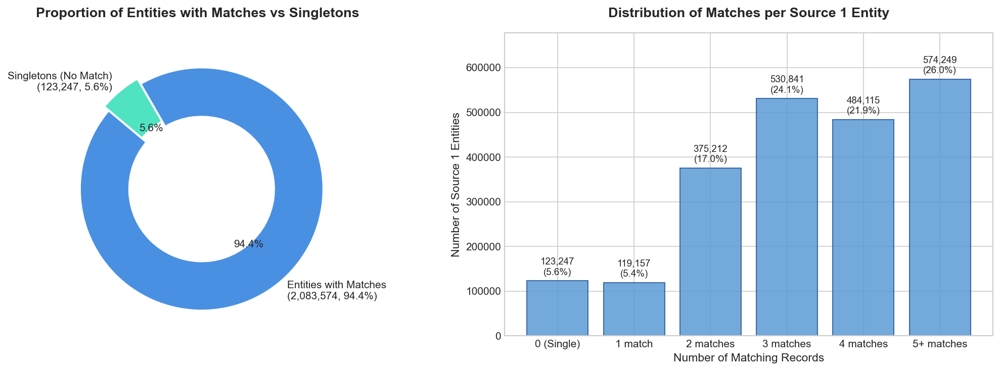
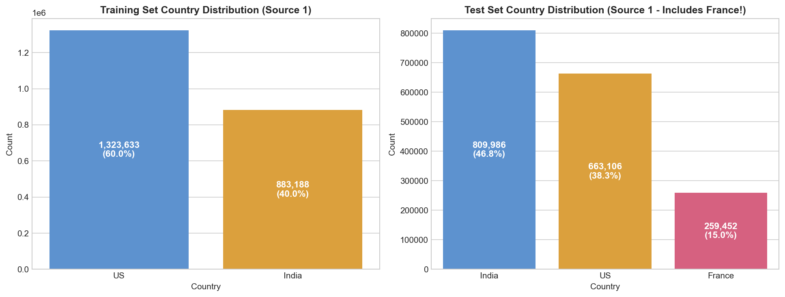
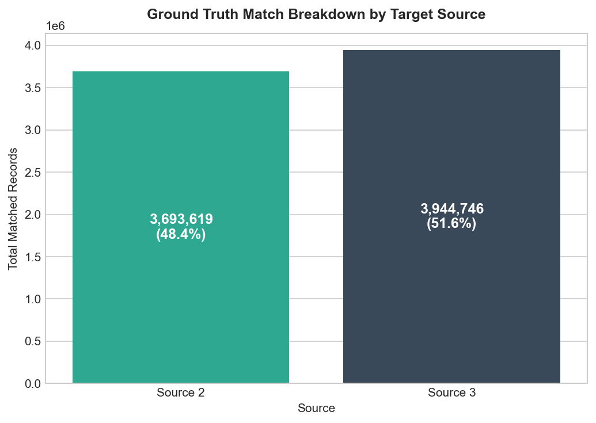
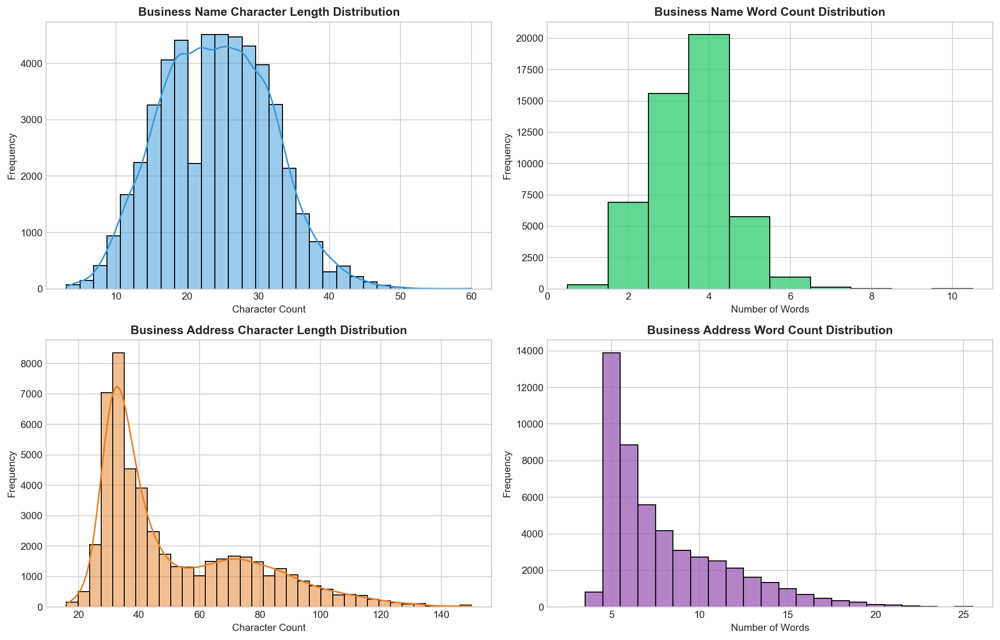
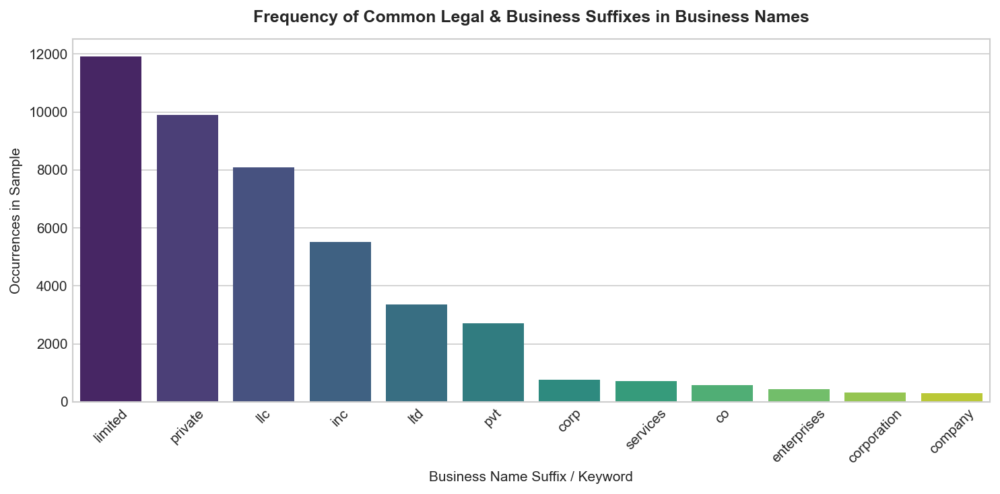

# Exploratory Data Analysis (EDA) Findings & Visualizations

> **Business Entity Resolution — Amazon ML Challenge 2026**  
> *A plain-English summary of what the data looks like, what patterns exist, and what strategies will work best.*

---

## 1. What is this Problem in Plain English?

Imagine three different directories (Source 1, Source 2, and Source 3) that store information about businesses (names and addresses).
- **Source 1** is our main reference directory.
- **Source 2** and **Source 3** are other incoming sources with noisy, messy, or abbreviated information.
- There are **no shared IDs** (like tax IDs or phone numbers).
- **Our Goal:** For every business in **Source 1**, find all the matching records in **Source 2** and **Source 3** that refer to the exact same real-world business.
- **Evaluation Metric:** **$F_{0.5}$ score** (Precision-heavy: False matches are penalized **twice as heavily** as missed matches).

---

## 2. Dataset Scale at a Glance

The dataset is massive. Here are the exact numbers calculated directly from the challenge files:

| Dataset File | Role | Number of Records | Size on Disk |
| :--- | :--- | :--- | :--- |
| **`train_source1.tsv`** | Training Reference Entities | **2,206,821** records | ~210 MB |
| **`train_source2.tsv`** | Training Candidate Pool 1 | **5,034,616** records | ~489 MB |
| **`train_source3.tsv`** | Training Candidate Pool 2 | **5,285,603** records | ~503 MB |
| **`train_ground_truth.tsv`** | True Matches | **2,206,821** rows (7,638,365 links) | ~127 MB |
| **`test_source1.tsv`** | Test Reference Entities | **1,732,544** records | ~175 MB |
| **`test_source2.tsv`** | Test Candidate Pool 1 | **4,887,273** records | ~509 MB |
| **`test_source3.tsv`** | Test Candidate Pool 2 | **5,082,316** records | ~506 MB |

> **Key Takeaway:** With ~1.7 million test entities and ~10 million candidate records in Source 2 and 3, comparing every pair directly would require **17 trillion comparisons** ($1.7 \times 10^{13}$). A smart **blocking (candidate filtering)** strategy is essential to narrow this down to manageable candidates.

---

## 3. Finding 1: Match Distribution & The "Singleton" Factor

### What the chart shows:
- **94.42% (2,083,574 entities)** have at least one matching record in Source 2 or Source 3.
- **5.58% (123,247 entities)** are **singletons** — they have **zero** matching records in Source 2 or Source 3.
- The average matched entity has **3 to 4 matching records** (peak at 3 matches: 530,841 businesses; 4 matches: 484,115 businesses).

### Why this matters:
1. **Singletons earn full credit:** If an entity has no match in ground truth, predicting an empty list gives a perfect score of **1.0**. But if our model guesses even one incorrect match, the score drops straight to **0.0**.
2. **Be conservative:** Because of the precision-heavy $F_{0.5}$ metric, when the model is not confident, it is safer to output nothing than to guess blindly.

---

## 4. Finding 2: Watch Out for France in the Test Set!

### What the chart shows:
- **Training Data:** Covers only **US (59.9%)** and **India (40.1%)**.
- **Test Data:** Covers **India (46.7%)**, **US (38.3%)**, and **France (15.0% — 259,452 entities)**!

### Why this matters (Critical Insight):
- **France does not appear anywhere in the training data.**
- If you train a machine learning model using hardcoded country one-hot encodings (`is_US`, `is_India`), or filter the pipeline to only US and India, the model will **completely fail on 15% of the test set**.
- **Solution:** Make your preprocessing, tokenization, and blocking logic country-agnostic or open-ended. Use relative features like `same_country (True/False)` instead of hardcoded country names.

---

## 5. Finding 3: Target Match Split (Source 2 vs Source 3)

### What the chart shows:
- Of the **7,638,365** true matches in the training ground truth:
  - **48.4% (3,693,619)** are from **Source 2**.
  - **51.6% (3,944,746)** are from **Source 3**.

### Why this matters:
- The matches are almost evenly split between Source 2 and Source 3.
- Both sources are equally important and must be searched with equal weight.

---

## 6. Finding 4: Name and Address Text Patterns

### What the data reveals:
1. **Name Lengths:**
   - Most business names are between **10 to 30 characters long** (2 to 4 words).
   - Names frequently contain abbreviations: `Inc`, `LLC`, `Corp`, `Corporation`, `Pvt`, `Private`, `Ltd`, `Limited`, `Co`, `Company`.
   - Often one source writes `"Acme Corp"` while another writes `"Acme Corporation"` or `"Acme Pvt Ltd"`.

2. **Address Variations:**
   - Most addresses are between **30 to 80 characters long** (5 to 15 words).
   - In the US, addresses follow street/city/state/ZIP patterns (e.g., `St`, `Ave`, `Rd`, `Blvd`).
   - In India, addresses frequently use landmarks (`Near Bus Stand`, `Opposite Railway Station`) and 6-digit PIN codes.
   - In France, addresses use French terms (`Rue`, `Avenue`, `Boulevard`, `Cedex`) with 5-digit postal codes.

---

## 7. Simple & Practical Action Plan for Modeling

| Stage | What To Do | Why It Works |
| :--- | :--- | :--- |
| **1. Text Cleaning** | Standardize abbreviations (`corp` $\rightarrow$ `corporation`, `rd` $\rightarrow$ `road`), lowercase, remove special punctuation. | Bridges the gap between variations like `"Acme Corp."` and `"Acme Corporation"`. |
| **2. Blocking (Candidate Search)** | Group entities by `Country` + `First Name Word` or `3-Character Prefix`. | Cuts down comparisons from 17 trillion to ~30-50 high-quality candidates per entity. |
| **3. Feature Engineering** | Compute similarity scores: Token Jaccard, Character 3-Gram Overlap, Levenshtein Edit Distance, and Postal Code Match. | Captures both typographical errors and word order transpositions. |
| **4. Precision Tuning** | Calibrate decision threshold to maximize $F_{0.5}$ (aim for high precision $\ge 0.85$). | $F_{0.5}$ rewards precision twice as much as recall; avoiding wrong merges is key to winning. |

---

*All visualization figures are stored under [`reports/figures/`](./figures/).*
